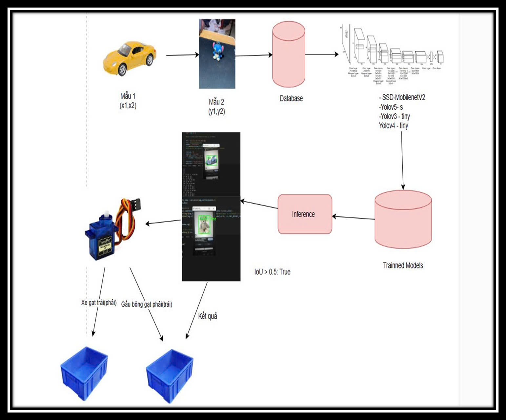
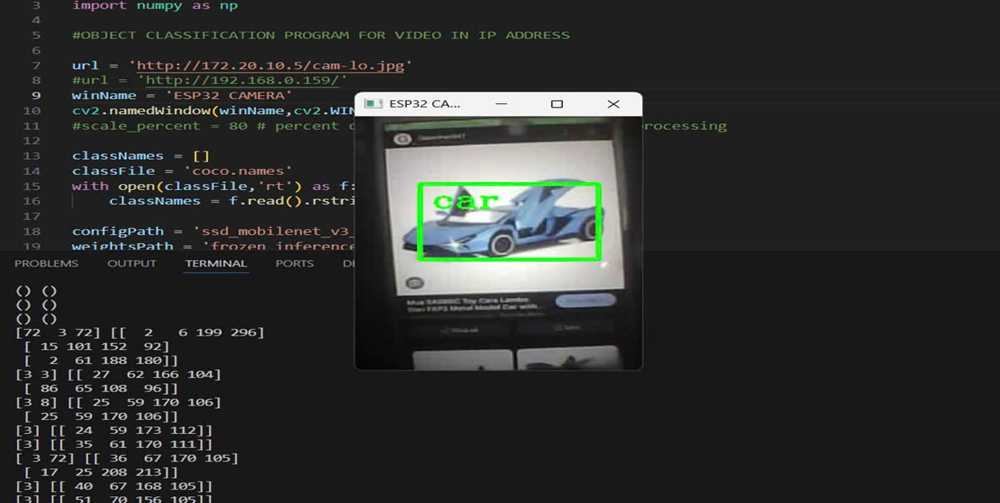
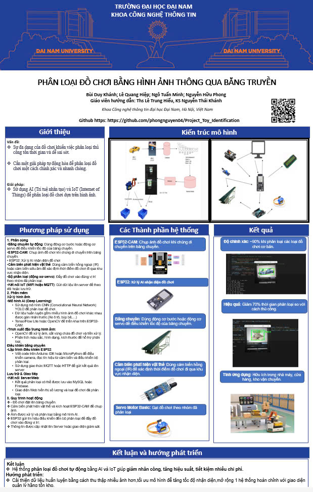

<h1 align="center">
📌 Dự Án Nhận Diện Đồ Chơi
</h1>

  
  

 

<h2 align="center">✨ Mô tả dự án</h2>

  Dự án này sử dụng <strong>YOLO</strong> để phân loại đồ chơi từ hình ảnh được chụp từ <strong>ESP32-CAM</strong>. Hệ thống dùng <strong>Flask</strong> làm backend để xử lý ảnh và gửi dữ liệu về giao diện web, đồng thời kết nối với <strong>Arduino</strong> để điều khiển phần cứng.

<h2 align="center">🚀 Cấu trúc dự án</h2>
<pre>
📂 Nghien_cuu_phan_loai_DCDC
├── 📸 anhcam/                   # Thư mục lưu trữ hình ảnh từ camera
├── 🔌 PhanCung/                  
│   ├── ⚙️ BTL.ino               # Arduino code cho phần cứng
│   └── 📡 CameraWebServer.ino   # Arduino code cho Camera Web Server
├── 💻 REDMI/                    # Thư mục chứa code liên quan đến REDMI
├── 🎨 static/                   # Tài nguyên tĩnh (CSS, JS, hình ảnh, …)
│   └── 📄 .gitkeep             # File giữ chỗ cho thư mục rỗng
├── 🌐 templates/                # Giao diện HTML cho Flask
│   └── 🖥️ index.html           # Giao diện trang web
├── 🤖 best.pt                   # File mô hình YOLO đã huấn luyện
├── 📦 requirements.txt          # Danh sách các thư viện Python cần cài đặt
└── 🐍 web.py                    # Flask server và xử lý ảnh
</pre>

## Chuẩn bị 
### 🛠️ Phần cứng

  

### 💻 Phần mềm

<h2 align="center">📦 Các thư viện Python cần thiết</h2>

  <strong>Các gói cần cài đặt:</strong> 
  - Flask==2.3.2 
  - ultralytics==8.0.0 
  - opencv-python==4.8.0.76 
  - numpy==1.24.3 
  - pyserial==3.5  
  <strong>Lệnh cài thư viện:</strong> 
  - (Tùy chọn) Tạo môi trường ảo:  
  <code>python -m venv venv</code> 
  <code>source venv/bin/activate   # Linux/MacOS</code> 
  <code>venv\Scripts\activate      # Windows</code>  
  - Cài đặt các gói:  
  <code>pip install -r requirements.txt</code> 
  Hoặc cài đặt trực tiếp:  
  <code>pip install Flask==2.3.2 ultralytics==8.0.0 opencv-python==4.8.0.76 numpy==1.24.3 pyserial==3.5</code>  
  - <strong>Chạy Flask server:</strong>  
  <code>python web.py</code>

<h2 align="center">🧮 Bảng mạch</h2>

  ⛓️‍💥 <strong>Hướng dẫn cắm dây:</strong>

<h4 align="center">Cảm biến FM52</h4>

<table>
  <tr>
    <th>Thiết bị</th>
    <th>Chân</th>
    <th>Giá trị</th>
    <th>Ghi chú</th>
  </tr>
  <tr>
    <td>Cảm biến FM52</td>
    <td>VCC</td>
    <td>5V</td>
    <td>Cấp nguồn cho cảm biến</td>
  </tr>
  <tr>
    <td></td>
    <td>GND</td>
    <td>GND</td>
    <td>Nối đất</td>
  </tr>
  <tr>
    <td></td>
    <td>OUT</td>
    <td>D7</td>
    <td>Xuất tín hiệu phát hiện vật thể</td>
  </tr>
</table>

 

<h4 align="center">Relay (Điều khiển băng chuyền)</h4>

<table>
  <tr>
    <th>Thiết bị</th>
    <th>Chân</th>
    <th>Giá trị</th>
    <th>Ghi chú</th>
  </tr>
  <tr>
    <td>Relay (Điều khiển băng chuyền)</td>
    <td>VCC</td>
    <td>5V</td>
    <td>Cấp nguồn cho relay</td>
  </tr>
  <tr>
    <td></td>
    <td>GND</td>
    <td>GND</td>
    <td>Nối đất</td>
  </tr>
  <tr>
    <td></td>
    <td>IN</td>
    <td>D8</td>
    <td>Điều khiển relay đóng/ngắt băng chuyền</td>
  </tr>
  <tr>
    <td></td>
    <td>COM</td>
    <td>1 cực của nguồn băng chuyền</td>
    <td>Dòng điện vào relay</td>
  </tr>
  <tr>
    <td></td>
    <td>NO</td>
    <td>1 cực của động cơ băng chuyền</td>
    <td>Khi relay mở, băng chuyền chạy</td>
  </tr>
</table>

 

<h4 align="center">Băng chuyền</h4>

<table>
  <tr>
    <th>Thiết bị</th>
    <th>Chân</th>
    <th>Giá trị</th>
    <th>Ghi chú</th>
  </tr>
  <tr>
    <td>Băng chuyền</td>
    <td>+</td>
    <td>Nối với NO của relay</td>
    <td>Nhận điện khi relay mở</td>
  </tr>
  <tr>
    <td></td>
    <td>-</td>
    <td>GND</td>
    <td>Hoàn thành mạch</td>
  </tr>
</table>

 

<h4 align="center">Servo</h4>

<table>
  <tr>
    <th>Thiết bị</th>
    <th>Chân</th>
    <th>Giá trị</th>
    <th>Ghi chú</th>
  </tr>
  <tr>
    <td>Servo</td>
    <td>VCC</td>
    <td>5V</td>
    <td>Cấp nguồn cho servo</td>
  </tr>
  <tr>
    <td></td>
    <td>GND</td>
    <td>GND</td>
    <td>Nối đất</td>
  </tr>
  <tr>
    <td></td>
    <td>Signal</td>
    <td>D9</td>
    <td>Nhận tín hiệu điều khiển từ Arduino</td>
  </tr>
</table>

<h2 align="center">🚀 Hướng dẫn cài đặt và chạy</h2>

  <strong>1. Chuẩn bị phần cứng:</strong> 
  - Nạp mã Arduino: 
  &nbsp;&nbsp;&bull; Mở file <code>BTL.ino</code> bằng Arduino IDE. 
  &nbsp;&nbsp;&bull; Kết nối board Arduino với máy tính. 
  &nbsp;&nbsp;&bull; Nạp (upload) mã nguồn lên board. 
  &nbsp;&nbsp;&bull; Đảm bảo Arduino xuất hiện trên cổng COM. 
  - Nạp mã cho ESP32-CAM với file <code>CameraWebServer.ino</code>.  
  <strong>2. CÀI ĐẶT PHẦN MỀM:</strong> 
  <strong>2.1 Cài đặt Arduino IDE:</strong> 
  &nbsp;&nbsp;&bull; Tải Arduino IDE tại: <a href="https://www.arduino.cc/en/software" target="_blank">Arduino Software</a>. 
  &nbsp;&nbsp;&bull; Cài đặt Driver CH340 nếu dùng board Arduino clone.  
  <strong>2.2 Cài đặt thư viện cho Arduino:</strong> 
  &nbsp;&nbsp;&bull; Mở Arduino IDE → Library Manager (Ctrl + Shift + I), tìm và cài: <code>Servo.h</code> (Điều khiển servo)

<h2 align="center">Hoạt động của hệ thống</h2>

  

  <strong>1️⃣ Khởi động hệ thống:</strong> 
  - Bật nguồn cho Arduino, ESP32-CAM và máy tính. 
  - Mở Serial Monitor (115200 baud) trên Arduino IDE để theo dõi hoạt động. 
  - Chạy Flask Server trên PC bằng lệnh: <code>python web.py</code>  
  <strong>Quy trình hoạt động:</strong> 
  - Server nhận ảnh từ ESP32-CAM và phân loại bằng YOLO. 
  - Khi phát hiện quả, kết quả được gửi qua cổng Serial đến Arduino. 
  - ESP32-CAM chụp ảnh và gửi về máy tính. 
  - Python với YOLO phân loại ảnh và gửi kết quả về Arduino: 
  &nbsp;&nbsp;&rarr; <strong>"Car"</strong> → Băng chuyền chạy tiếp (4 giây). 
  &nbsp;&nbsp;&rarr; <strong>"Toys"</strong> → Băng chuyền chạy 1.9 giây, sau đó servo gạt quả hỏng (quay 90° trong 2 giây rồi quay lại). 
  &nbsp;&nbsp;&rarr; <strong>"unknown"</strong> → Không kích hoạt phần cứng, chỉ in thông báo. 
  - Arduino nhận kết quả và điều khiển động cơ, servo theo từng loại quả.

<h2 align="center">Giải thích code</h2>

  <strong>Arduino Code (arduino_code.ino):</strong> 
  - <em>Khởi tạo:</em> Khởi tạo Serial ở tốc độ 115200, cấu hình chân cho cảm biến, relay và servo. Servo được gắn tại chân 9 và khởi tạo về góc 0°. 
  - <em>Vòng lặp chính:</em> Đọc trạng thái của cảm biến. Khi cảm biến thay đổi trạng thái hoặc sau khoảng thời gian định kỳ, gửi lệnh "CHECK" và chờ phản hồi từ Python. 
  - <em>Xử lý kết quả:</em> 
  &nbsp;&nbsp;&rarr; Nếu nhận "ô tô": Kích hoạt relay chạy trong 4 giây. 
  &nbsp;&nbsp;&rarr; Nếu nhận "đồ chơi": Kích hoạt relay chạy 1.9 giây, quay servo 90° trong 2 giây, sau đó quay lại 0°. 
  &nbsp;&nbsp;&rarr; Nếu không nhận phản hồi: In thông báo timeout. 
  &nbsp;&nbsp;&rarr; Nếu nhận vật thể không phải hoa quả cần nhận diện "unknown": Không kích hoạt phần cứng và in thông báo "No relevant object detected; skipping processing.".  
  <strong>Flask &amp; YOLO Code (web.py):</strong> 
  - <em>Khởi tạo:</em> Flask server khởi chạy tại <code>http://0.0.0.0:5000/</code> và tải mô hình YOLO từ file <code>best.pt</code>. 
  - <em>Xử lý ảnh:</em> Lấy ảnh từ ESP32-CAM qua URL, chạy YOLO để nhận diện đối tượng (quả cam tươi/hỏng), cập nhật ảnh annotate và kết quả phân loại. 
  - <em>Giao tiếp với Arduino:</em> Khi nhận lệnh "CHECK" qua Serial, Flask sẽ chụp ảnh mới, xử lý và gửi kết quả ("ô tô", "đồ chơi" hoặc "unknown") về Arduino. 
  - <em>Giao diện web:</em> Hiển thị video feed từ camera, thông tin FPS, trạng thái camera và cảnh báo.

<h2 align="center">📸 Kết quả hiển thị</h2>

  
<strong>Ảnh car khi cam nhận diện:</strong>

  
  
  
<strong>Ảnh toys khi cam nhận diện:</strong>

  

 

<h2 align="center">🌟 Poster ✨</h2>

<strong>Poster nhóm</strong>

  

 

<h2 align="center">🤝 Đóng góp</h2>

Dự án được phát triển bởi 4 thành viên:

<table>
  <thead>
    <tr>
      <th>Họ và Tên</th>
      <th>Vai trò</th>
    </tr>
  </thead>
  <tbody>
    <tr>
      <td>Lê Quang Hiệp</td>
      <td>Phát triển toàn bộ mã nguồn, tìm kiếm dữ liệu, lắp đặt phần cứng, train model, kiểm thử, triển khai dự án và thực hiện video giới thiệu, ngân sách thiết bị.</td>
    </tr>
    <tr>
      <td>Ngô Tuấn MinhMinh</td>
      <td>Biên soạn tài liệu overlef, hỗ trợ train model, thu thập dữ liệu, viết latext, làm poster, làm powpoint, thuyết trình, ngân sách thiết bị.</td>
    </tr>
    <tr>
      <td>Nguyễn Hưu Phong</td>
      <td>Biên soạn tài liệu overlef, hỗ trợ train model, thu thập dữ liệu, viết latext, làm poster, làm powpoint, thuyết trình, ngân sách thiết bị.</td>
    </tr>
    <tr>
      <td>Bùi Duy Khánh</td>
      <td>Thu thập dữ liệu, gắn nhãn dữ liệu, hỗ trợ train model, lắp đặt phần cứng, kiểm thử, triển khai video giới thiệu, ngân sách thiết bị.</td>
    </tr>
  </tbody>
</table>

© 2025 NHÓM 7, CNTT16-06, TRƯỜNG ĐẠI HỌC ĐẠI NAM

